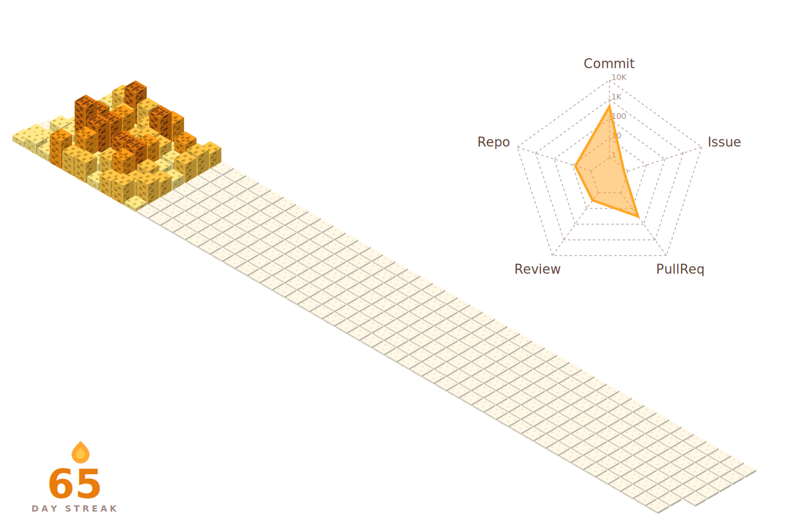

  <picture>
    <source media="(prefers-color-scheme: dark)" srcset="https://streak-stats.demolab.com/?user=justinwuzijin&sections=current&hide_border=true&border_radius=0&card_width=200&background=0d111700&ring=E87D0D&fire=FF9F1C&currStreakNum=FFC847&currStreakLabel=0d111700&sideNums=0d111700&sideLabels=0d111700&dates=0d111700&type=svg" />
    <source media="(prefers-color-scheme: light)" srcset="https://streak-stats.demolab.com/?user=justinwuzijin&sections=current&hide_border=true&border_radius=0&card_width=200&background=ffffff00&ring=E87D0D&fire=FF9F1C&currStreakNum=E87D0D&currStreakLabel=ffffff00&sideNums=ffffff00&sideLabels=ffffff00&dates=ffffff00&type=svg" />
    
  </picture>

  

